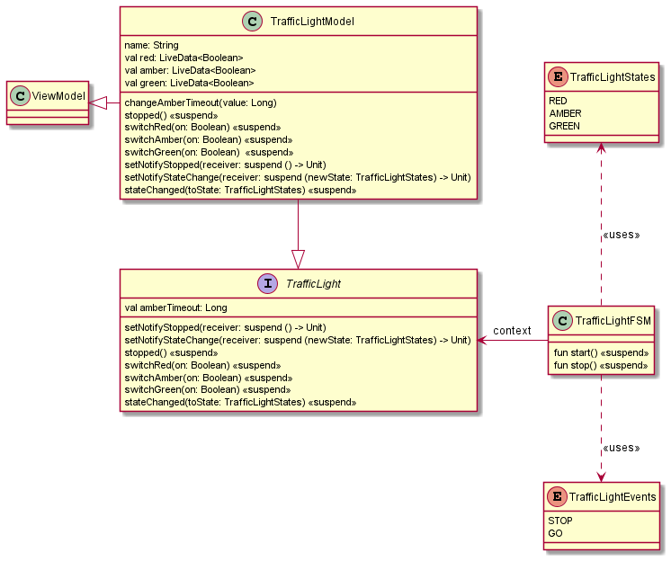
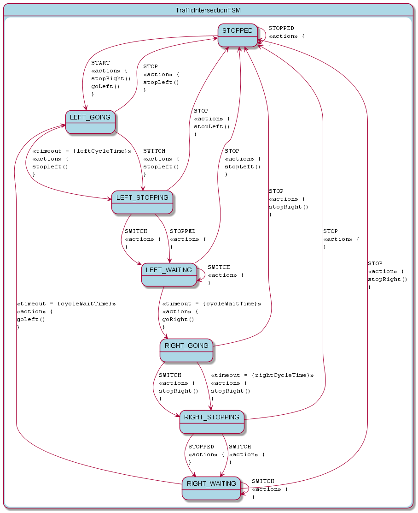
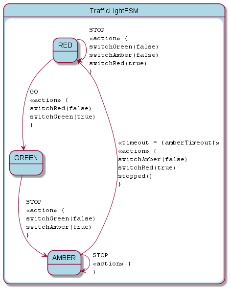

= KFSM Android Compose Traffic Intersection Demo

This application demonstrates using 2 state machines to provide a solution.
The traffic light state machine operates the light and only has a stop and go event. The stop event will switch to amber and after a timeout switch to red and generate a stopped notification.

The intersection state machine cycles through controlling the left and the right traffic light while waiting after stopped before sending the go event to the other light.

The application illustrates how to create a view models that uses `LiveData` to represent the changing values and states so that compose can update the UI efficiently.

== Demo

video::kfsm-android-compose.mp4[]

link:kfsm-android-compose.mp4[Demo Video]

== Class Diagrams

=== Traffic Light Classes

=== Traffic Intersection Classes

== Generated Traffic Light Models

include::generated/traffic-light.adoc[]

== Generated Intersection Models

include::generated/traffic-intersection.adoc[]
