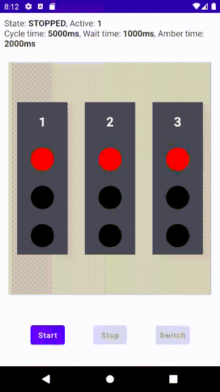

= KFSM Android Compose Traffic Intersection Demo
:figure-caption!:

This application demonstrates using 2 state machines to provide a solution.
The traffic light state machine operates the light and only has a stop and go event. The stop event will switch to amber and after a timeout switch to red and generate a stopped notification.

The intersection state machine cycles through controlling the lights in order, sending go to current light and then waiting after stopped before switching to next light sending the go event.

The `TrafficIntersectionModel` can be created by providing a different number of lights.

The application illustrates how to create a view models that uses `LiveData` to represent the changing values and states so that compose can update the UI efficiently.

== Demo

=== Two Traffic Lights

=== Three Traffic Lights

=== Downloads

* link:kfsm-android-compose2.mp4[Demo 2 Lights Download]
* link:kfsm-android-compose3.mp4[Demo 3 Lights Download]

== Traffic Intersection Classes

image:traffic-intersection-model.png[]

== Generated Traffic Light Models

image:traffic-light.png[]

include::generated/traffic-light.adoc[]

== Generated Intersection Models

image:traffic-intersection.png[]

include::generated/traffic-intersection.adoc[]
